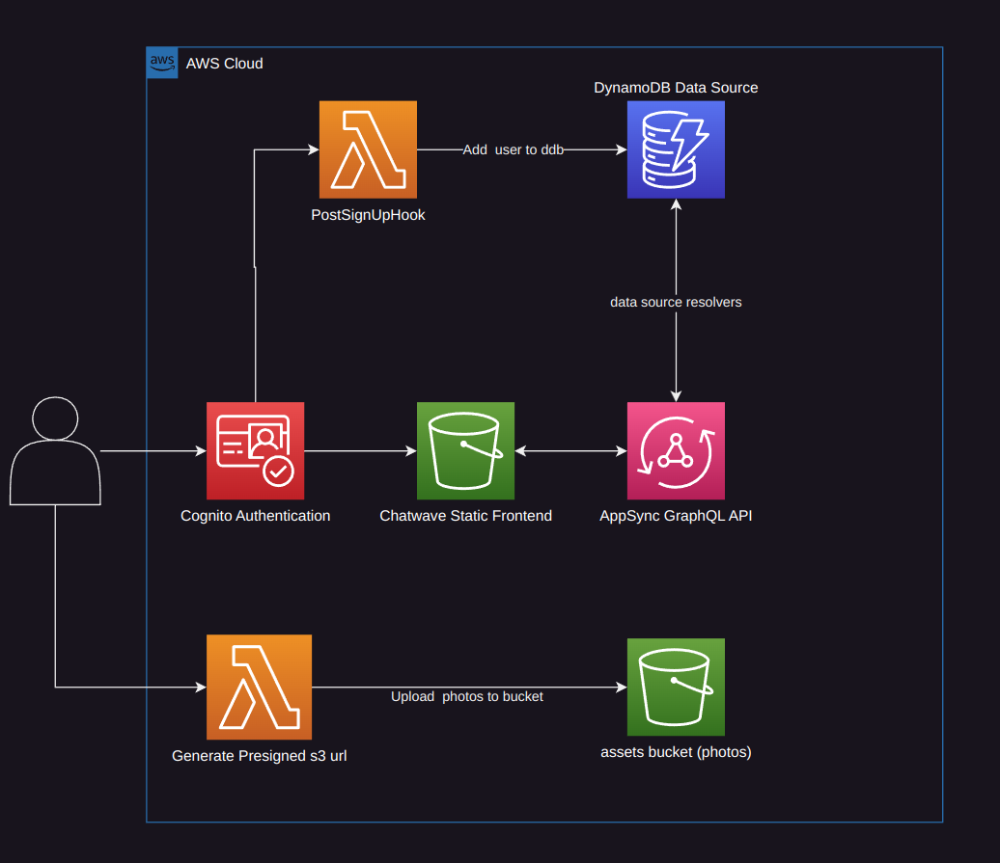

# AWS Serverless Chat Application



## Overview

This is a fully serverless real-time chat application that could scale with minimal effort.

## Tech Stack

- Appsync, DynamoDB, S3, Cognito, Cloudfront
- AWS Amplify Library
- NextJs
- Typescript (Frontend & CDK)
- Projen CDK

## Getting Started

1. Install dependencies in infrastructure and frontend

```bash
npm i
```

2. Build the static website in the frontend

```bash
npm run build
```

3. cd into infratructure and deploy

```bash
npx projen deploy
```

4. Update frontend environment variables with new created resources

- create .env.local in frontend and DO NOT USE quotes in this file because it will pass the quotes in the production build static website

```bash
NEXT_PUBLIC_AWS_REGION=us-east-1
NEXT_PUBLIC_COGNITO_USER_POOL_ID=us-east-1_xxxxxxxxx
NEXT_PUBLIC_COGNITO_WEB_CLIENT_ID=xxxxxxxxxxxxxxxxxxxxxxxxxx
NEXT_PUBLIC_APPSYNC_GRAPHQL_ENDPOINT=xxxxxxxxxxxxxxxxxxxxxxxxxxxxxxxxxxxxxxxxxxxxxxxxxxxxxxxxxxxxxxxxxxxxxxxxxxxxxx
NEXT_PUBLIC_PRESIGNED_URL_ENDPOINT=xxxxxxxxxxxxxxxxxxxxxxxxxxxxxxxxxxxxxxxxxxxxxxxxxxxxxxxxxxx
NEXT_PUBLIC_CLOUDFRONT_URL=ASSETS_BUCKET_CLOUDFRONT_URLxxxxxxxxx
```

5. (linux) Update environment variables in ./bin/sync-s3.sh and run ./build-sync.sh

```bash
export CLOUDFRONT_DISTRIBUTION_ID='CLOUDFRONT_DISTRIBUTION_FOR_STATIC_WEBSITE'
export S3_WEBSITE_URL='STATIC_WEBSITE_BUCKET_NAME'
```

6. Create a guest user account with scripts ./bin/create-guest-cognito-user.sh && make sure to update this user in dynamodb with ./bin/cognito-update-dynamodb.py script

7. Now you can use the cloudfront URL to use the app. NOTE: you can use a custom domain by pointing the domain to cloudfront url as an alias. You will have to update the cloudfront distribution and route53

## Useful commands

To configure your graphql schema in the frontend, use this command with your appsync apiId.

```bash
amplify add codegen --apiId <appsyncId>
```

Then you can use the code below when you update your schema

```bash
amplify codegen
```

## My Struggles

1. **Subscribing to a list of rooms**

In order to recieve messages in rooms your not currently using, the user would have to subscribe to all other rooms. However there is no easy way for this to work (that I know of). A possible solution is using some sort of polling mechanism for newly received messages when your not in the messaging

## Resources

- AWS CDK [Link](https://docs.aws.amazon.com/cdk/api/v2/docs/aws-cdk-lib.aws_appsync-readme.html)
- AWS Amplify [Link](https://docs.amplify.aws/lib/graphqlapi/getting-started/q/platform/js/)
- AWS Example Solution [Link](https://github.com/aws-samples/amplify-nextjs-chat-app)

## TODO

- Delete room(conversation) possibly delete messages
